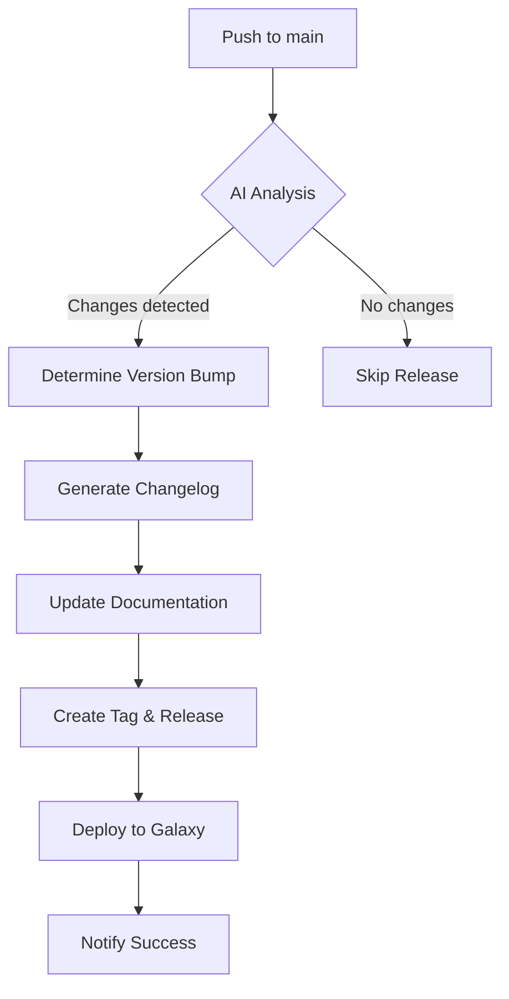

# AI-Powered Release Automation Guide

This document describes the fully automated, AI-enhanced release pipeline for the `oatakan.rhel_template_build` Ansible role.

## 🚀 Overview

Our automation system eliminates nearly all manual steps in the release process using:

1. **AI-Powered Analysis** - Intelligent version bumping and changelog generation
2. **Automated Release Pipeline** - Zero-touch releases from commit to Galaxy
3. **PR Enhancement** - AI enriches PRs with insights and suggestions
4. **Interactive AI Assistant** - Responds to commands in PR comments

## 🔧 Setup

### 1. Required Secrets

Add these to your GitHub repository secrets:

```yaml
ANSIBLE_GALAXY_API_KEY: # From galaxy.ansible.com preferences
OPENAI_API_KEY:         # Optional: OpenAI API key
ANTHROPIC_API_KEY:      # Optional: Anthropic Claude API key
```

> **Note**: You need at least one AI provider (OpenAI or Anthropic) for full functionality. The system gracefully degrades to rule-based analysis if no AI keys are provided.

### 2. Enable Workflows

All workflows are in `.github/workflows/`:
- `auto-release.yml` - Main automated release pipeline
- `pr-enrichment.yml` - AI PR analysis and enhancement
- `ci.yml` - Standard CI/CD tests
- `galaxy.yml` - Direct Galaxy deployment (backup)

## 🤖 How It Works

### Automated Release Flow



### AI Decision Making

The AI analyzes:
- **Commit messages** - Conventional commits, keywords
- **Changed files** - Impact assessment
- **Code diffs** - Breaking change detection
- **PR history** - Context from merged PRs

Version bump logic:
- **MAJOR**: Breaking changes, removed features, dropped support
- **MINOR**: New features, new variables with defaults
- **PATCH**: Bug fixes, documentation, minor improvements

## 📋 Feature Details

### 1. Automated Release Pipeline

**Triggers**:
- Every push to main branch
- Weekly schedule (Sunday midnight)
- Manual trigger via GitHub Actions

**Process**:
1. AI analyzes all changes since last release
2. Determines if release is needed
3. Calculates appropriate version bump
4. Generates changelog and release notes
5. Updates documentation
6. Creates git tag and GitHub release
7. Deploys to Ansible Galaxy
8. Sends notification

**Zero Manual Steps!** 🎉

### 2. PR Enhancement

When a PR is opened:
1. AI analyzes the changes
2. Posts comprehensive analysis comment
3. Updates PR description with metadata
4. Adds appropriate labels
5. Suggests reviewers (if configured)

**Example PR Comment**:
```markdown
## 🤖 AI Pull Request Analysis

### Summary
This PR adds support for RHEL 10 by updating package lists and 
conditionally installing gdisk only for versions < 10.

### Metadata
- **Change Type:** Feature
- **Risk Level:** 🟡 Medium
- **Estimated Review Time:** 15-20 minutes

### Testing Recommendations
- Run molecule tests on RHEL 10
- Verify package installation on all supported versions
- Test upgrade scenarios

### Code Quality Notes
- Follows Ansible best practices
- Good use of conditional logic

### Compatibility Considerations
- Maintains backward compatibility
- No breaking changes detected

### Documentation Needs
- Update README.md with RHEL 10 support
- Update compatibility matrix
```

### 3. Interactive AI Assistant

Use commands in PR comments:

| Command | Description |
|---------|-------------|
| `/ai review` | Detailed code review with line-by-line feedback |
| `/ai test` | Generate comprehensive test scenarios |
| `/ai changelog` | Create changelog entry for the PR |
| `/ai docs` | Identify documentation updates needed |
| `/ai improve` | Suggest code improvements |
| `/ai help` | Show available commands |

**Example**:
```
/ai review
```

The AI will respond with detailed feedback on code quality, best practices, and potential issues.

### 4. Intelligent Documentation Updates

The AI automatically:
- Updates variable documentation when defaults change
- Adds version badges
- Updates copyright years
- Marks new features with version tags
- Maintains consistent formatting

## 🛠️ Customization

### Adjusting AI Behavior

Edit the prompts in the Python scripts to customize:
- Version bump sensitivity
- Changelog format
- PR analysis focus
- Documentation style

### Adding Custom Checks

Extend `ai_release_analyzer.py`:

```python
def custom_check(self, commits, files):
    # Your custom logic
    if 'security' in str(commits):
        return 'major'  # Force major bump for security
    return None
```

### Disabling Features

Set these in workflow files:
```yaml
env:
  SKIP_AI_ANALYSIS: false
  SKIP_DOC_UPDATE: false
  SKIP_PR_ENHANCEMENT: false
```

## 📊 Cost Management

AI API usage is optimized:
- Caches results where possible
- Limits token usage
- Falls back to rule-based analysis
- Only analyzes recent changes

Estimated monthly cost:
- Small project (< 50 PRs/month): ~$5-10
- Medium project (50-200 PRs/month): ~$20-40
- Large project (> 200 PRs/month): ~$50-100

## 🔍 Monitoring

Track automation health:
- GitHub Actions tab shows all runs
- Release notifications in Actions summary
- Failed releases trigger alerts
- AI analysis reasoning logged

## 🚨 Troubleshooting

### Release Not Triggering

1. Check for commits since last tag:
   ```bash
   git log $(git describe --tags --abbrev=0)..HEAD --oneline
   ```

2. Manually trigger:
   - Actions → Automated Release Pipeline → Run workflow

### AI Analysis Failing

1. Check API keys are set correctly
2. Verify API quota/credits
3. System falls back to rule-based analysis

### Galaxy Deploy Failing

1. Verify `ANSIBLE_GALAXY_API_KEY` is valid
2. Check Galaxy import status
3. Use manual workflow as backup

## 🎯 Best Practices

1. **Commit Messages**: Use conventional commits
   - `feat:` for features (triggers minor)
   - `fix:` for bugs (triggers patch)
   - `BREAKING CHANGE:` for breaking (triggers major)

2. **PR Descriptions**: Be descriptive
   - AI uses these for context
   - Helps generate better changelogs

3. **Regular Releases**: Let automation handle it
   - Weekly schedule catches accumulated changes
   - Prevents release fatigue

4. **Trust the AI**: But verify
   - Review generated changelogs
   - Check version bumps make sense
   - Override when needed

## 🔮 Future Enhancements

Planned improvements:
- [ ] Auto-generate migration guides for breaking changes
- [ ] AI-powered security scanning
- [ ] Automated dependency updates with compatibility checking
- [ ] Performance regression detection
- [ ] Multi-language documentation generation

## 💡 Tips

- The AI learns from your commit style - be consistent
- Use PR labels to help AI categorization
- Review AI-generated content before releases
- Keep AI API keys secure and rotate regularly

---

**Remember**: This automation enhances your workflow but doesn't replace human judgment. Always review critical releases manually when needed.