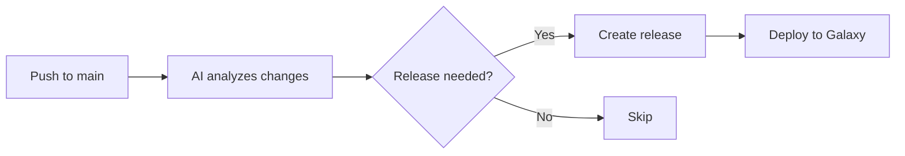

# 🚀 Automation Quick Reference

## Release Process (Fully Automated)



**That's it!** Just push to main and AI handles everything.

## PR Commands

| Command | What it does |
|---------|--------------|
| `/ai review` | Get detailed code review |
| `/ai test` | Generate test scenarios |
| `/ai changelog` | Create changelog entry |
| `/ai docs` | Check documentation needs |
| `/ai improve` | Get improvement suggestions |
| `/ai help` | Show all commands |

## Manual Controls

### Force a Release
```yaml
# Go to Actions → Automated Release Pipeline → Run workflow
# Check "Force release even without changes"
```

### Skip Release
```bash
# Add [skip ci] to commit message
git commit -m "chore: update docs [skip ci]"
```

### Override Version
```bash
# Create tag manually (automation will detect and use it)
git tag v2.0.0
git push origin v2.0.0
```

## Commit Message Format

| Prefix | Version Bump | Example |
|--------|--------------|---------|
| `fix:` | Patch (0.0.X) | `fix: correct hostname reset` |
| `feat:` | Minor (0.X.0) | `feat: add RHEL 10 support` |
| `BREAKING CHANGE:` | Major (X.0.0) | `feat!: remove deprecated vars` |
| `chore:` | None | `chore: update tests` |
| `docs:` | None/Patch | `docs: improve examples` |

## Configuration

### Required Secrets
- `ANSIBLE_GALAXY_API_KEY` ✅ Required

### Optional Secrets  
- `OPENAI_API_KEY` - For GPT-4 analysis
- `ANTHROPIC_API_KEY` - For Claude analysis

## Monitoring

- **Release Status**: Actions tab → Automated Release Pipeline
- **PR Analysis**: Check PR comments
- **Galaxy Status**: https://galaxy.ansible.com/my-imports

## Troubleshooting

| Issue | Solution |
|-------|----------|
| Release didn't trigger | Check commits exist since last tag |
| AI not working | Verify API keys are set |
| Galaxy deploy failed | Check API key is valid |
| PR not analyzed | Ensure workflows are enabled |

## Quick Setup

```bash
# Run from repository root
./scripts/setup-automation.sh

# Follow the prompts to:
# 1. Check files are in place
# 2. Configure GitHub secrets
# 3. Create initial tag if needed
```

---

**Remember**: The system fails gracefully - if AI isn't available, it uses rule-based analysis. If Galaxy deploy fails, you can always trigger manually.